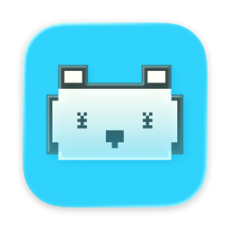
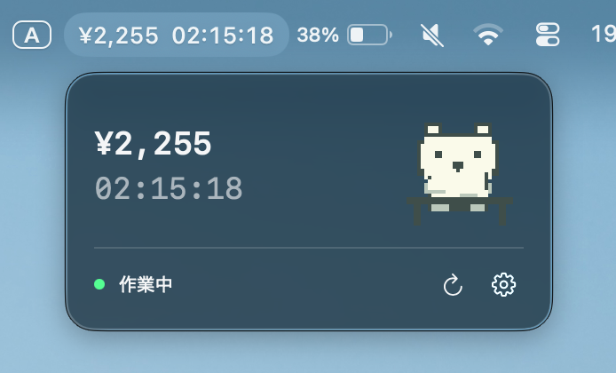

  

<h1 align="center">EarnBear</h1>

macOS 13以降 / Apple Silicon。SwiftUI MenuBarExtraで、Clockifyの実行中の作業の金額と経過時間を毎秒表示します。

Clockifyの非公式ツールです。

  

## 起動・設定

1. Xcodeで`EarnBear.xcodeproj`を開き、EarnBearスキーム / My MacでRunします。
2. メニューバーの「¥ — 設定」を押し「設定…」を開きます。
3. Clockifyのユーザー設定で取得したAPIキーを入力します。「接続を確認」を押し、対象Workspaceを選んで「このWorkspaceで開始」を押します。
4. 固定時給を確認し「設定を保存」を押します。APIキーをチャットに送る必要はありません。
5. Clockifyで普段どおりタイマーを開始・停止します。

APIキーはこのMacのKeychainに保存します。設定ファイルやログには書きません。アプリはClockifyにGETリクエストのみ送信します。Keychainの許可ダイアログが出た場合は、このアプリのアクセスを許可してください。

## 表示

- 現在の作業の金額・経過時間、説明、適用時給、最終同期時刻。
- 時給はhydrated Time EntryのhourlyRateが取得でき、通貨がJPYの場合に利用。Clockifyの整数金額を100で割って円/時間に変換します。取得不可・JPY以外の場合は固定時給で概算します。
- 「請求可能な時間のみ」がオフの場合、非Billableの作業も金額計算します。請求書・給与額を保証する表示ではありません。
- 通信障害中は最後に取得した開始時刻から推定を続け、≈と警告を表示します。
- BREAKは金額計算の対象外です。今日の累計は未実装です。ログイン時自動起動は設定の「起動」から切り替えられます。

## API確認間隔

初期値3分（通常の定期取得で毎時20リクエスト）。無料プランの上限はWorkspace全体で毎時30回で、初期設定や他アプリの利用も共有します。有料プランでは15秒・30秒を選べます。表示自体は常に毎秒更新しますが、開始・停止の検出には確認間隔分の遅れが発生します。HTTP 429時は1時間待って再試行します。

## 参照

- https://docs.clockify.me/
- https://clockify.me/help/getting-started/webhook-and-api-limitations
- https://forum.clockify.me/t/monetary-amounts/1873
